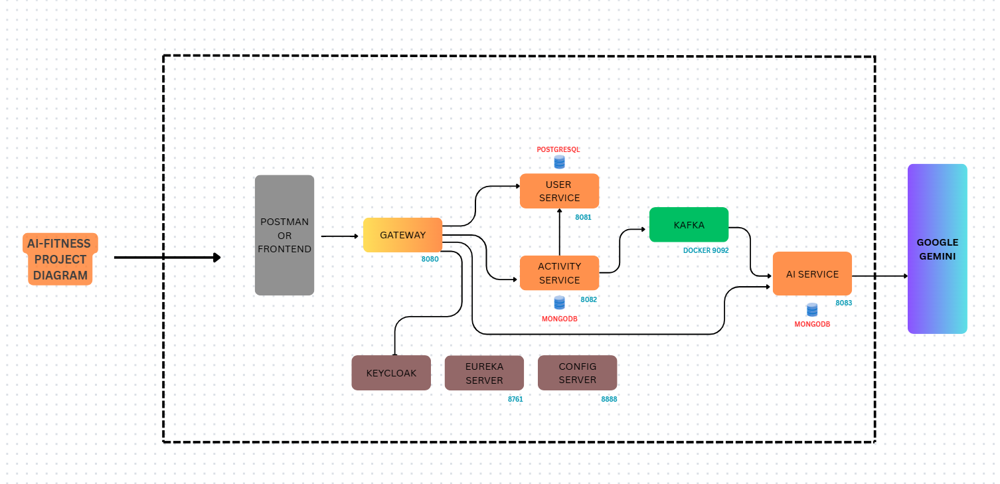
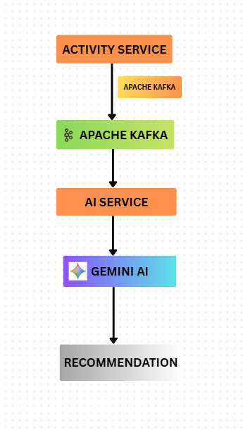

# 🏋️ AI Fitness Recommendation Microservices

An AI-powered fitness recommendation platform built using a
microservices architecture. The system collects workout and
fitness activity data from users and uses Google Gemini AI to
generate personalized recommendations including overall analysis,
improvements, suggestions, and safety guidance.

---

## 📌 Overview

The application is designed as a distributed microservices-based
fitness platform where different services are responsible for
authentication, user management, activity tracking, AI-powered
recommendations, service discovery, and API routing.

The AI service processes fitness activity data asynchronously
through Apache Kafka and generates personalized recommendations
using Google Gemini AI.

---

## 🏗️ System Architecture

The system consists of multiple independent services communicating
through REST APIs and event-driven messaging.

---

## 🚀 Key Features

- 🔐 Keycloak-based authentication and authorization
- 🏃 Fitness activity tracking
- 🤖 AI-powered fitness recommendations using Google Gemini
- 💡 Personalized improvement recommendations
- 🏋️ Workout suggestions
- ⚠️ Safety recommendations
- 🔄 Event-driven communication using Apache Kafka
- 🌐 Centralized API routing through API Gateway
- 🔎 Service discovery using Netflix Eureka
- 🗄️ PostgreSQL for user-related data
- 🍃 MongoDB for activity and AI recommendation data
- ⚙️ Centralized configuration using Spring Cloud Config

---

## 🔄 Application Flow

1. The user authenticates through Keycloak.
2. The frontend sends authenticated requests to the API Gateway.
3. The API Gateway routes requests to the appropriate microservice.
4. The Activity Service receives and stores fitness activity data.
5. The Activity Service publishes an activity event to Apache Kafka.
6. The AI Service consumes the activity event.
7. The AI Service creates an AI prompt using the activity data.
8. Google Gemini AI analyzes the fitness activity.
9. The generated recommendation is processed by the AI Service.
10. The recommendation is stored in MongoDB.
11. The frontend retrieves and displays the personalized recommendation.

---

## 🧩 Microservices

| Service | Responsibility | Port |
|---|---|---:|
| API Gateway | Central entry point and request routing | 8080 |
| User Service | User management and user data | 8081 |
| Activity Service | Fitness activity management | 8082 |
| AI Service | AI recommendation generation | 8083 |
| Eureka Server | Service discovery | 8761 |
| Config Server | Centralized configuration | 8888* |

> *Configure the actual Config Server port according to your current configuration.

---

## 🛠️ Technology Stack

### Backend

- Java
- Spring Boot
- Spring Cloud
- Spring WebFlux / WebClient
- Spring Data JPA
- Spring Data MongoDB

### Microservices

- Spring Cloud Gateway
- Netflix Eureka
- Spring Cloud Config
- Apache Kafka

### Authentication

- Keycloak
- OAuth 2.0
- JWT

### Databases

- PostgreSQL
- MongoDB

### Artificial Intelligence

- Google Gemini AI

### Development Tools

- IntelliJ IDEA
- Maven
- Git
- GitHub
- Postman

---

## 🔐 Authentication & Security

Authentication is handled through Keycloak.

The application uses JWT-based authentication to secure requests
between the client, API Gateway, and backend services.

The API Gateway validates authenticated requests and handles
communication with downstream microservices.

Sensitive credentials such as API keys and passwords are not stored
directly in the source code and should be supplied through
environment variables or local configuration.

---

## 🤖 AI Recommendation

The AI Service uses Google Gemini to analyze fitness activity data.

The generated recommendation is structured into different sections,
including:

### Overall Analysis

Provides an analysis of the user's fitness activity.

### Improvements

Identifies areas where the user can improve their activity or workout.

### Suggestions

Provides personalized workout and fitness suggestions.

### Safety

Provides safety-oriented guidance based on the activity data.

---

## 📨 Event-Driven Communication

Apache Kafka is used for asynchronous communication between the
Activity Service and AI Service.

